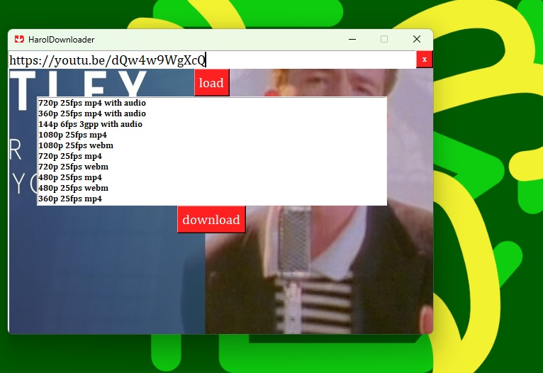

# HarolDownloader 


HarolDownloader is a Python application built with Tkinter that allows you to easily download YouTube or spotify videos or audio files. Whether you want to save an individual video, extract audio from a video, or even download videos from a playlist, HarolDownloader has got you covered.

## Features

- Downlaod spotify
- Download YouTube videos or audio files effortlessly.
- Supports downloading both individual videos and entire playlists.
- Choose between downloading video or audio only.
- Simple and intuitive user interface powered by Tkinter.
- Ability to select specific videos from a playlist to download.


## Installation

1. Ensure you have Python 3.x installed on your system. If not, you can download it from the official Python website: [https://www.python.org/downloads/](https://www.python.org/downloads/).

2. Clone the HarolDownloader repository from GitHub:

```bash
git clone https://github.com/wasp-byte/HarolDownloader.git
```

3. Change into the project directory:

```bash
cd HarolDownloader
```

4. Install the required dependencies using pip:

```bash
pip install -r requirements.txt
```

## Usage Single

1. Run the `main.py` file to start the application:

```bash
python main.py
```

2. The HarolDownloader user interface will appear.

3. To download a single video or audio file, enter the YouTube video URL in the designated input field and click the "Load" button.

4. Possible video and audio formats will appear

5. You can then choose a suitable format and quality from the list

6. To download the selected format, click the "Download" button.

7. Using the file dialog choose your preferred file location.



## Usage Playlist

1. Run the `main.py` file to start the application:

```bash
python main.py
```

2. The HarolDownloader user interface will appear.

3. To download a playlist, enter the YouTube video URL in the designated input field and click the "Load" button.

4. Possible titles will appear

5. You can choose which videos you want to download

6. To download the selected videos, click the "Download" button

7. The formats will appear, you can choose which you want and you click the "Download" button

8. Using the file dialog choose your preferred file location.


## Acknowledgments

The HarolDownloader app is inspired by the meme "Hide the Pain Harold," which represents a man smiling despite his hidden pain. The app's name is a playful reference to this meme.


## License

HarolDownloader is released under the [MIT License](LICENSE). Feel free to modify and distribute the application as per the terms of the license.

## Contributing

Contributions are welcome! If you have any ideas, bug reports, or feature requests, please open an issue or submit a pull request on GitHub. Let's make HarolDownloader even better together.

<a href="https://github.com/FreePlacki"></a>
<a href="https://github.com/Fleserig73"></a>

## Disclaimer

Please note that HarolDownloader should only be used to download videos or audio files for personal use or when you have the necessary rights to do so. Respect copyright laws and the terms of service of YouTube. The developers of HarolDownloader are not responsible for any unauthorized use of the application.
